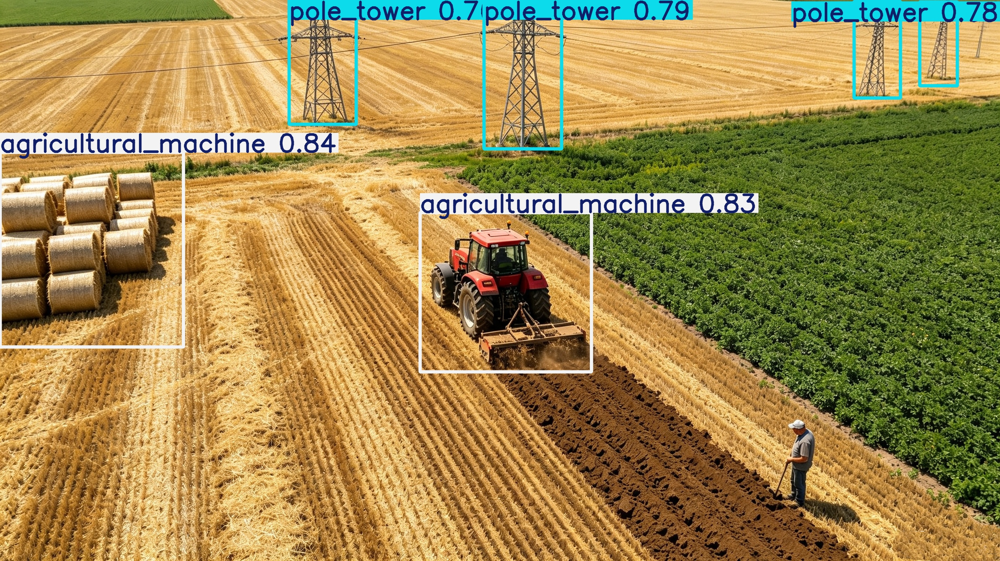

# AgriUAV YOLOv8 Detection / AgriUAV YOLOv8 农业无人机目标检测

<p align="center">
  
</p>

## Overview / 项目概述

本项目是一个基于 Ultralytics YOLOv8 的农业无人机目标检测工程，用于检测 UAV 视角下的五类目标：`person`、`pole_tower`、`agricultural_machine`、`animal`、`hay_bale`。当前主模型为 `YOLOv8n-P2-ECA-SimAM`，重点提升小目标检测能力。

This project is an agricultural UAV object detection system based on Ultralytics YOLOv8. It detects five classes from UAV-view images: `person`, `pole_tower`, `agricultural_machine`, `animal`, and `hay_bale`. The main model is `YOLOv8n-P2-ECA-SimAM`, designed to improve small-object detection.

## Key Features / 主要特点

- 基于 YOLOv8n 的轻量检测模型。
- 增加 P2/4 检测分支，适合无人机小目标。
- 在 P2 分支加入 ECA 与 SimAM 注意力。
- 提供训练、YOLO 格式数据集验证、图片/文件夹可视化推理脚本。
- 默认使用本地改造版 `ultralytics`，支持自定义模块。

- Lightweight detector based on YOLOv8n.
- Adds a P2/4 detection branch for UAV small objects.
- Adds ECA and SimAM attention to the P2 branch.
- Provides scripts for training, YOLO-format dataset validation, and image/folder visualization inference.
- Uses the local modified `ultralytics` package by default to support custom modules.

## Directory Structure / 目录结构

```text
agriculture_UAV_Detect/
  data/
    agri_uav.yaml
  scripts/
    train_agri.py
    train_agri_p2.sh
    train_agri_p2_eca.sh
    train_agri_p2_simam.sh
    train_agri_p2_eca_simam.sh
    val_agri.py
    val_agri.sh
    predict_agri.py
    predict_agri.sh
  tests/
    test_agri_models.py
  ultralytics/
    cfg/models/v8/
    nn/modules/agri_attention.py
  runs/detect/agri_p2_eca_simam/weights/
    best.pt
    last.pt
../AgriUAV_yolo_dataset/
  images/train
  images/test
  labels/train
  labels/test
  data.yaml
```

项目命令建议在 `agriculture_UAV_Detect` 根目录执行。

Run project commands from the `agriculture_UAV_Detect` root directory.

## Dataset / 数据集

数据集为 YOLO 检测格式。项目配置文件为 `data/agri_uav.yaml`，默认数据集路径为 `../AgriUAV_yolo_dataset`。

The dataset uses YOLO detection format. The project dataset config is `data/agri_uav.yaml`, and the default dataset path is `../AgriUAV_yolo_dataset`.

```yaml
path: ../AgriUAV_yolo_dataset
train: images/train
val: images/test
test: images/test
nc: 5
names:
  0: person
  1: pole_tower
  2: agricultural_machine
  3: animal
  4: hay_bale
```

当前数据集规模为训练集 6400 张、验证/测试集 1600 张。图片和标签已检查为一一对应。

The current dataset contains 6400 training images and 1600 validation/test images. Images and labels have been checked to match one-to-one.

### Dataset Download / 数据集下载

数据集已公开分享，可通过百度网盘下载：

The dataset is publicly available via Baidu Netdisk:

- 链接 / Link: https://pan.baidu.com/s/1gW1jbu8gz3XmaQF1W_OOYw?pwd=hxw8
- 提取码 / Code: `hxw8`

## Model / 模型

主模型配置文件：

Main model YAML:

```text
ultralytics/cfg/models/v8/yolov8n-p2-eca-simam-agri.yaml
```

模型结构概要：

- Backbone 使用 YOLOv8n 风格结构。
- Head 使用 P2/P3/P4/P5 四尺度检测。
- P2 分支输出前经过 ECA 和 SimAM。
- Detect 输入为 `[P2-ECA-SimAM, P3, P4, P5]`。

Model structure summary:

- YOLOv8n-style backbone.
- Four-scale detection head with P2/P3/P4/P5.
- The P2 branch passes through ECA and SimAM before detection.
- Detect receives `[P2-ECA-SimAM, P3, P4, P5]`.

## Attention Modules / 注意力模块

ECA 是轻量通道注意力，通过全局平均池化和一维卷积生成通道权重，参数量极小。SimAM 是无参数的神经元级注意力，通过能量函数估计每个位置和通道的重要性。

ECA is a lightweight channel attention module that generates channel weights using global average pooling and a small 1D convolution. SimAM is a parameter-free neuron-wise attention module that estimates the importance of each spatial-channel response using an energy function.

## Environment / 环境

推荐使用已配置的 conda 环境：

Use the configured conda environment:

```bash
conda activate yolo
cd /home/qc004/task1/task1/agriculture_UAV_Detect
```

已验证环境包含 Python 3.9、PyTorch CUDA 和 Ultralytics 8.4.104。

The environment has been verified with Python 3.9, PyTorch CUDA, and Ultralytics 8.4.104.

## Training / 训练

推荐训练主模型：

Recommended command for the main model:

```bash
bash scripts/train_agri_p2_eca_simam.sh
```

当前主脚本默认参数：

Current defaults in the main script:

```text
model: ultralytics/cfg/models/v8/yolov8n-p2-eca-simam-agri.yaml
data: data/agri_uav.yaml
imgsz: 640
epochs: 350
batch: 32
device: 0
optimizer: SGD
amp: False
pretrained: False
```

如果显存不足，使用较小 batch：

If CUDA memory is insufficient, use a smaller batch:

```bash
bash scripts/train_agri_p2_eca_simam.sh \
  --batch 16 \
  --name agri_p2_eca_simam_b16
```

## Validation on YOLO Dataset / YOLO 数据集验证

使用封装脚本对 YOLO 格式数据集计算 Precision、Recall、mAP：

Use the validation wrapper to calculate Precision, Recall, and mAP on a YOLO-format dataset:

```bash
bash scripts/val_agri.sh \
  --model runs/detect/agri_p2_eca_simam/weights/best.pt \
  --data data/agri_uav.yaml \
  --imgsz 640 \
  --batch 16 \
  --device 0 \
  --name agri_val_best
```

如需验证 `test` split：

To validate the `test` split:

```bash
bash scripts/val_agri.sh \
  --split test \
  --name agri_test_best
```

## Prediction and Visualization / 图片预测与可视化

对单张图片预测并保存可视化结果：

Predict one image and save visualized results:

```bash
bash scripts/predict_agri.sh /path/to/image.jpg \
  --model runs/detect/agri_p2_eca_simam/weights/best.pt \
  --conf 0.25 \
  --device 0 \
  --name agri_predict_one
```

对文件夹批量预测：

Predict an image folder:

```bash
bash scripts/predict_agri.sh /path/to/images \
  --model runs/detect/agri_p2_eca_simam/weights/best.pt \
  --conf 0.25 \
  --device 0 \
  --name agri_predict_dir
```

输出默认保存到 `runs/detect/<name>`。

Outputs are saved to `runs/detect/<name>` by default.

## Trained Weights / 已训练权重

当前已训练模型权重：

Current trained weights:

```text
runs/detect/agri_p2_eca_simam/weights/best.pt
runs/detect/agri_p2_eca_simam/weights/last.pt
```

训练结果显示除 `person` 外，其他类别效果较理想。`person` 类召回偏低，后续建议补充更多 UAV 视角下的人类小目标样本，并用 `best.pt` 进行低学习率微调。

Training results show that all classes except `person` perform well. The `person` class has low recall. Future work should add more UAV-view small-person samples and fine-tune from `best.pt` with a lower learning rate.

## Tests / 结构测试

`tests/test_agri_models.py` 是模型结构测试，不是 mAP 验证脚本。它检查 ECA/SimAM、P2/P3/P4/P5 输出尺度、检测头类别数、参数量和 GFLOPs。

`tests/test_agri_models.py` is a model structure test, not an mAP evaluation script. It checks ECA/SimAM, P2/P3/P4/P5 output strides, detection class count, parameter count, and GFLOPs.

```bash
pytest tests/test_agri_models.py
```
